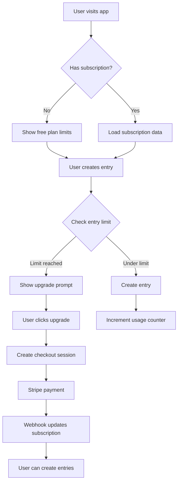

# Subscription Core Infrastructure

This module provides the foundation for managing Stripe subscriptions in Mivoa.

## Environment Variables

Add the following variables to `.env.local`:

```bash
# Stripe Configuration
STRIPE_SECRET_KEY=sk_test_...
STRIPE_WEBHOOK_SECRET=whsec_...

# Basic Plan (4 price IDs)
STRIPE_PRICE_ID_BASIC_MONTHLY_USD=price_...
STRIPE_PRICE_ID_BASIC_MONTHLY_CAD=price_...
STRIPE_PRICE_ID_BASIC_ANNUAL_USD=price_...
STRIPE_PRICE_ID_BASIC_ANNUAL_CAD=price_...

# Pro Plan (4 price IDs)
STRIPE_PRICE_ID_PRO_MONTHLY_USD=price_...
STRIPE_PRICE_ID_PRO_MONTHLY_CAD=price_...
STRIPE_PRICE_ID_PRO_ANNUAL_USD=price_...
STRIPE_PRICE_ID_PRO_ANNUAL_CAD=price_...
```

**Note:** The free plan does not require Stripe price IDs as it is not a paid subscription.

## Stripe Setup Checklist

- [ ] Create Stripe account (test mode)
- [ ] Create products:
  - [ ] Basic Monthly
  - [ ] Basic Annual
  - [ ] Pro Monthly
  - [ ] Pro Annual
- [ ] Create prices for each product:
  - [ ] USD prices (monthly and annual)
  - [ ] CAD prices (monthly and annual)
- [ ] Copy price IDs to environment variables
- [ ] Configure webhook endpoint:
  - [ ] URL: `https://your-domain.com/api/stripe/webhook`
  - [ ] Events: `customer.subscription.created`, `customer.subscription.updated`, `customer.subscription.deleted`
- [ ] Copy webhook signing secret to `STRIPE_WEBHOOK_SECRET`
- [ ] Test checkout flow in test mode
- [ ] Verify webhook events are received correctly

## Module Architecture

### Core Files

- `constants.ts` - Plan definitions, limits, pricing, and price ID helpers
- `types.ts` - TypeScript types for subscriptions, plans, and usage
- `stripe-client.ts` - Stripe client initialization
- `subscription-service.ts` - Subscription data fetching and validation
- `feature-gate.ts` - Feature access control based on plan
- `usage-tracker.ts` - Usage statistics tracking

### Helper Files

- `checkout-helpers.ts` - Checkout session validation and creation
- `utils.ts` - Utility functions (timestamp conversion, etc.)

### API Routes

- `/api/stripe/create-checkout` - Creates Stripe checkout session
- `/api/stripe/create-portal` - Creates customer portal session
- `/api/stripe/webhook` - Handles Stripe webhook events
- `/api/stripe/subscription-status` - Returns current subscription status
- `/api/stripe/plans` - Returns available plans and pricing

## Plan Limits

| Feature | Free | Basic | Pro |
|---------|------|-------|-----|
| Entries/month | 10 | 100 | Unlimited |
| AI Models | Basic | Enhanced | All |
| Export | ❌ | Standard | High resolution |
| Analysis | Basic | Enhanced | Full |
| Custom Templates | ❌ | ❌ | ✅ |

## Pricing Structure

- **Basic Monthly**: $9.99 USD / $13.99 CAD
- **Basic Annual**: $99.99 USD / $139.99 CAD (save 17%)
- **Pro Monthly**: $19.99 USD / $27.99 CAD
- **Pro Annual**: $199.99 USD / $279.99 CAD (save 17%)

## Subscription Flow



## Usage

### Checking Subscription Limits

```typescript
import { useSubscriptionLimits } from '@/hooks/use-subscription-limits';

const { canCreateEntry, checkBeforeCreate } = useSubscriptionLimits();
```

### Getting Current Usage

```typescript
import { getSubscriptionWithUsage } from '@/lib/subscription/subscription-service';

const subscription = await getSubscriptionWithUsage(userId);
const { entriesUsed, entriesLimit, lastResetDate, nextResetDate } = subscription.usage;

console.log(`Used ${entriesUsed} of ${entriesLimit} entries`);
console.log(`Next reset: ${nextResetDate}`);
```

### Feature Gating

```typescript
import { canUseModel, canExport, getFeatureLevel } from '@/lib/subscription/feature-gate';

if (canUseModel(plan, 'gpt-4o')) {
  // Allow advanced model
}

if (canExport(plan)) {
  // Allow export
}

const level = getFeatureLevel(plan); // 'basic' | 'intermediate' | 'advanced'
```

### Creating Checkout Session

```typescript
import { validateCheckoutRequest, createStripeCheckoutSession } from '@/lib/subscription/checkout-helpers';

const validation = validateCheckoutRequest(body, userId);
if (validation.success) {
  const url = await createStripeCheckoutSession({
    customer,
    priceId: validation.priceId!,
    userId,
    planId: validation.planId!,
    billingCycle: validation.billingCycle!,
    origin: window.location.origin,
  });
}
```

## Testing

Test checkout with Stripe test card: `4242 4242 4242 4242`

Use this card for testing subscription flows:
- Card number: `4242 4242 4242 4242`
- Expiry: Any future date (e.g., `12/34`)
- CVC: Any 3 digits (e.g., `123`)
- ZIP: Any 5 digits (e.g., `12345`)

## Build-Time Safety

The `getPriceId()` function includes build-time detection to prevent errors during Next.js builds. During build time, it returns an empty string instead of throwing an error when environment variables are not available.

